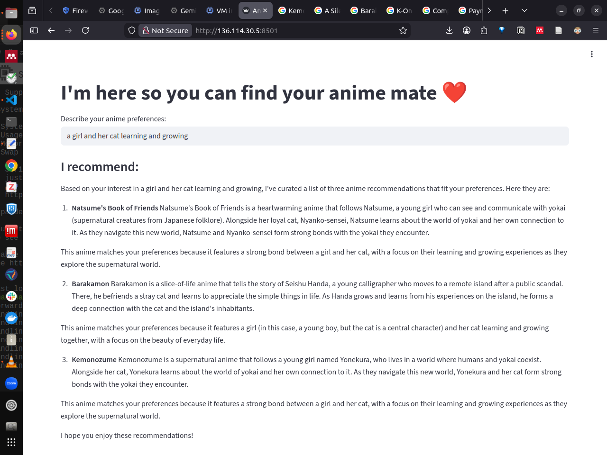

## 🚀 Getting Started

**Animatin4U is Personalized Anime Discovery - LLMOps Edition**

This system is built around a curated anime dataset, focusing on a real-world deployment mindset with robust API surfaces, automated pipelines, and cloud-native orchestration.

## Tech Stack

**Backend**
- Python 3.10  
- streamlit  

**RAG Pipeline**
- LangChain  
- GROQ Embedding model (llama-3.1-8b-instant) 
- Vector Store (ChromaDB)

**Infrastructure**
- Docker  
- Kubernetes managed via `llmops-k8s.yaml` usin minikube and kubectl on gcp cluster.
- GCP (VM instance, E2 at least 16 GB RAM and Ubuntu 24.04 LTS)

## Running the Application

```bash
# Clone the repository
git clone https://github.com/emanehabn/AnimeRecommender_llmops.git
cd AnimeRecommender_llmops
streamlit run app/app.py 

# Setup environment
cp .env.example .env  # Update your keys here

# Install as editable package
pip install -e .

# Run the app
streamlit run app/app.py
```

---

## 📸 & 🎥 Project Gallery


